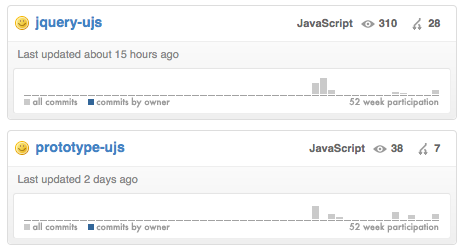

!SLIDE center

# ActionView #
***
<!-- Clear separation between ActoinController and ActionView -->
* ActionView exposes a __single API entry point__ for rendering templates and partials

!SLIDE bullets

* Template look-up is faster
* Rendering Partial collections is much faster

!SLIDE bullets
## XSS protection by default ##
***

!SLIDE code smaller
    
    @@@ruby
    = form_for @person do |f|
      content_tag(:h1) do
        = @person.title
      end
      = f.label :name, "Name"
      = f.text_field :name
      = f.label :profile, "Profile"
      = f.text_area :profile
      = f.submit
    end
***
    @@@html
    <form action="/posts" method="post">
      <h1>&lt;script&gt;more evil content here&lt;/script&gt;</h1>
      <label for="person_name">Name</label>
      <input type="text" name="person[name]" \
        id="person_name" value="Darth Vader" />
      <label for="person_profile">Profile</label>
      <textarea name="person[profile]" id="person_profile">
        &lt;script&gt;some evil content here&lt;/script&gt;
      </textarea>
      <input type="submit">Create</input>
    </form>

!SLIDE code

    @@@ruby
    # Mark html as safe in your helpers
    "
#{snatch_cookie}
".html_safe

    # Manually un-escape html in your views 
    raw( @user.description )

!SLIDE
## HTML5 &  Unobtrusive JavaScript helpers ##
***

!SLIDE code

    @@@ruby
    = form_for @post, :remote => true do |f|
***
    @@@html
    ...
    ...  
    ...
    ...
    ...
    ...
    
!SLIDE code

    @@@ruby
    = form_for @post, :remote => true do |f|
***
    @@@html
    <form 
      action="http://host.com"  
      id="create-post"  
      method="post"  
      data-remote="true">
    ...

!SLIDE code smaller

    @@@javascript
    // jQuery - rails.js 95
    $('form[data-remote]').live('submit', function (e) {
        $(this).callRemote();
        e.preventDefault();
    });
    
***
    @@@javascript
    // prototype - rails.js
    document.on("submit", function(event) {
        ...
        var element = event.findElement("form[data-remote]");
        if (element) {
          handleRemote(element);
          event.stop();
        }
      });
!SLIDE center
##  Core team maintains Prototype and jQuery drivers!  ##
***

!SLIDE

#Setting jQuery as the default is simple#

!SLIDE commandline
  
    $ curl -L http://code.jquery.com/jquery-1.4.2.min.js > / public/javascripts/jquery.js
    
    $ curl -L http://github.com/rails/jquery-ujs/raw/master/src/rails.js > public/javascripts/rails.js

!SLIDE code small

***
    @@@ruby
    # inside config/initializers
    module ActionView::Helpers::AssetTagHelper
      remove_const :JAVASCRIPT_DEFAULT_SOURCES
      JAVASCRIPT_DEFAULT_SOURCES = %w(jquery.js rails.js)
      reset_javascript_include_default
    end
  
    # inside your layout
    javascript_include_tag :default

!SLIDE code small
    @@@ruby
    # inside config/initializers
    ActionView::Helpers::AssetTagHelper.
      register_javascript_expansion(
        :jquery => %w/jquery jquery-ui rails application/
      )
      
    # inside your layout
    javascript_include_tag :jquery

